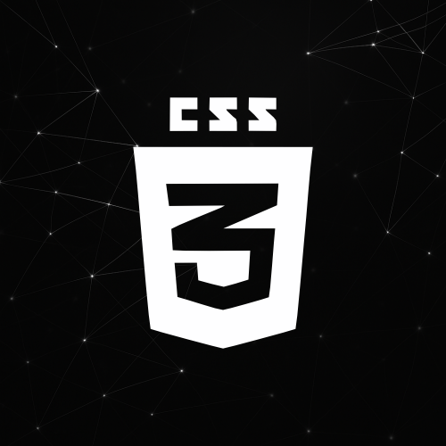
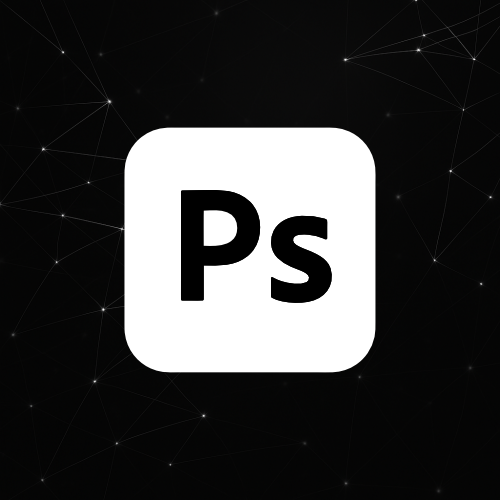
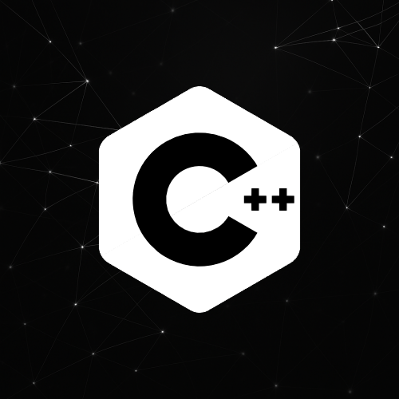
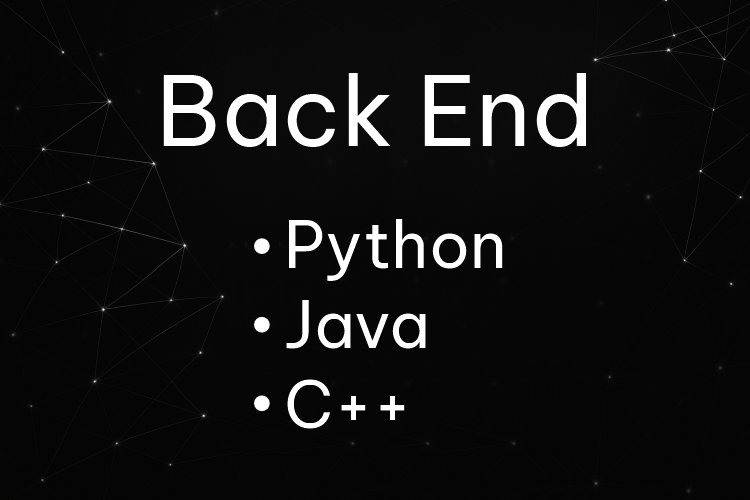
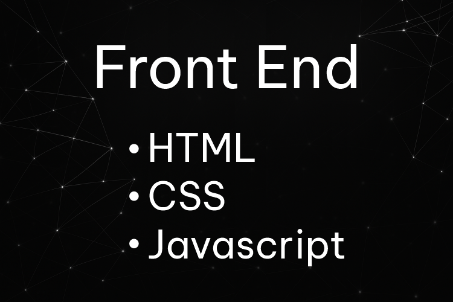
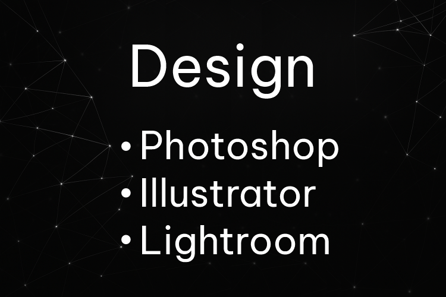

📘 Documentação do Projeto: Code Hub

🧾 Descrição Geral

# 💻 Code Hub - Site de Cursos Online

**Code Hub** é um site de cursos online voltado para a área de tecnologia. Desenvolvido com HTML, CSS e JavaScript, o projeto apresenta uma vitrine de cursos disponíveis, com páginas detalhadas para cada um e uma simulação de carrinho de compras (não funcional). Ideal como projeto de portfólio.

---

## 🚀 Funcionalidades

### 🏠 Página Inicial (`index.html`)
- Banner principal com destaque dos cursos.
- Seção de cursos recomendados.
- Barra de navegação funcional (links internos).
- Rodapé com informações de contato e redes sociais.

### 📚 Página de Cursos (`cursos.html`)
- Mostruário de cursos com:
  - Nome
  - Imagem
  - Botão de ação
- Layout responsivo e organizado por cards.

### 🛒 Carrinho de Compras (Simulação)
- Página de exemplo com cursos “adicionados”.
- Cálculo fictício de valores e total.
- Botões de "Finalizar Compra" (sem funcionalidade real).

---

## 🛠️ Tecnologias e Ferramentas Utilizadas

- **HTML5** – Estrutura das páginas.
- **CSS3** – Estilização e responsividade com Flexbox e Grid.
- **JavaScript (puro)** – Interações básicas e manipulação de elementos.
- **Visual Studio Code** – Editor de código com extensões auxiliares.
- **GitHub** – Repositório e deploy via GitHub Pages.
- **CorelDRAW** – Criação dos elementos gráficos (logo, banners, ícones).

---

## 📁 Estrutura do Projeto

```
code-hub/
│
├── index.html
├── produto.html
├── login.html
│
├── css/
│   └── style.css
│
├── js/
│   └── script.js
│
├── imagens/
│   ├── logo.png
│   ├── curso1.jpg
│   └── ...
│
└── README.md
```

---

## 📌 Observações Finais

- Projeto estático e funcional como front-end demonstrativo.
- Pronto para futura integração com back-end e sistema de pagamentos.
- Design limpo e centrado na experiência do usuário.

---

> Projeto desenvolvido para fins educativos e de portfólio.

Código completo em anexo do projeto: 

INDEX:

<!DOCTYPE html>
<html lang="en">

<head>
    <meta charset="UTF-8">
    <meta name="viewport" content="width=device-width, initial-scale=1.0">
    <link rel="stylesheet" href="css/style.css">
    
    <link
        href="https://fonts.googleapis.com/css2?family=Be+Vietnam+Pro:ital,wght@0,100;0,200;0,300;0,400;0,500;0,600;0,700;0,800;0,900;1,100;1,200;1,300;1,400;1,500;1,600;1,700;1,800;1,900&family=Bowlby+One&family=Chau+Philomene+One:ital@0;1&family=Fira+Sans+Condensed:ital,wght@0,100;0,200;0,300;0,400;0,500;0,600;0,700;0,800;0,900;1,100;1,200;1,300;1,400;1,500;1,600;1,700;1,800;1,900&family=Kanit:ital,wght@0,100;0,200;0,300;0,400;0,500;0,600;0,700;0,800;0,900;1,100;1,200;1,300;1,400;1,500;1,600;1,700;1,800;1,900&family=Nunito:ital,wght@0,200..1000;1,200..1000&family=Poppins:ital,wght@0,100;0,200;0,300;0,400;0,500;0,600;0,700;0,800;0,900;1,100;1,200;1,300;1,400;1,500;1,600;1,700;1,800;1,900&family=Roboto+Flex:opsz,wght@8..144,100..1000&family=Ubuntu:ital,wght@0,300;0,400;0,500;0,700;1,300;1,400;1,500;1,700&display=swap"
        rel="stylesheet">
        <title>Code Hub</title>
        <link rel="icon" href="img/icone.png" type="image/x-icon">
    </head>

<body>
    
    <header>
        <div class="menu">
            <ul>
                <li><a href="index.html">Code Hub</a>
                </li>
            </ul>
        </div>
        <div class="menu">
        </div>
        <div class="menu">
            <nav>
                <ul>
                    <li><a href="login.html">Log-in</a></li>
                    <li><a href="#" id="openCart">Carrinho</a></li>
                </ul>
            </nav>
        </div>
    </header>
    <div class="img">
        <div class="imagem">
            <p class="titulo"> Code Hub </p>
            <p class="subtitulo"> Codificando o conhecimento, compilando o aprendizado </p>
            
        </div>
    </div>
    <section>
        <p>Cursos em alta</p>
        <div class="Section">
            <div class="Produto"><a href='produto.html'></a></div>
            <div class="Produto"><a href='produto3.html'></a></div>
            <div class="Produto"><a href='produto4.html'></a></div>
            <div class="Produto"><a href='produto5.html'></a></div>
            <div class="Produto"><a href='produto7.html'></a></div>
        </div>
    </section>
    <br>
    <section>
        <p>Novidades da semana</p>
        <div class="Section">
            <div class="Produto"><a href='produto8.html'></a></div>
            <div class="Produto"><a href='produto2.html'></a></div>
            <div class="Produto"><a href='produto6.html'></a></div>
            <div class="Produto"><a href='produto9.html'></a></div>
            <div class="Produto"><a href='produto0.html'></a></div>
        </div>
        </div>
    </section>
    <br>
    <section>
        <p>Tipos de curso</p>
        <div class="Section2">
            <div class="Vantagens"></div>
            <div class="Vantagens"></div>
            <div class="Vantagens"></div>
        </div>
    </section>
    <footer>
        <div class="Footer">
            <h2>Nossos Cursos</h2>
            <br>
            <div class="foot">
                <div class="nomes">
                    <h3>Back end</h3>
                    <br>
                    <a href='produto4.html'><p>Python</p></a>
                    <br>
                    <a href='produto5.html'><p>Java</p></a>
                    <br>
                    <a href='produto6.html'><p>C++</p></a>
                    <br>
                </div>
                <div class="nomes">
                    <h3>Front end</h3>
                    <br>
                    <a href='produto2.html'><p>HTML</p></a>
                    <br>
                    <a href='produto.html'><p>CSS</p></a>
                    <br>
                    <a href='produto3.html'><p>JavaScript</p></a>
                    <br>
                </div>
                <div class="nomes">
                    <h3>Design</h3>
                    <br>
                    <a href='produto7.html'><p>Photoshop</p></a>
                    <br>
                    <a href='produto8.html'><p>Illustrator</p></a>
                    <br>
                    <a href='produto9.html'><p>Lightroom</p></a>
                    <br>
                </div>
                <div class="nomes">
                    <h3>Banco de Dados</h3>
                    <br>
                    <a href='produto0.html'><p>PHP</p></a>
                    <br>
                </div>
            </div>
            <br>
            <hr>
            <br>
            <p class="hub">Code Hub ® 2025</p>
        </div>
    </footer>

    <div id="cartContainer" class="cart-visible"> <!-- Força visível pra testar -->
        <div class="cart-content">
            <button id="closeCart">&times;</button>
            <h2 style="color: #000;">🛒 Seu Carrinho</h2>
    
            <div id="cartItems">
                <p style="color: #000;">Curso de JavaScript - R$ 49,90</p>
                <p style="color: #000;">Curso de C++ Avançado - R$ 69,00</p>
            </div>
        </div>
    
        <div class="cart-footer">
            <p style="color: #000;">
                Total: <span id="cartTotal" style="color: #000;">R$ 118,90</span>
            </p>
            <button id="checkoutBtn">Finalizar Compra</button>
        </div>
    </div>
    <script>
        document.addEventListener('DOMContentLoaded', () => {
            const cartLink = document.getElementById('openCart');
            const cartContainer = document.getElementById('cartContainer');
            const closeBtn = document.getElementById('closeCart');
    
            cartLink.addEventListener('click', (e) => {
                e.preventDefault();
                cartContainer.classList.add('visible');
                cartContainer.classList.remove('cart-hidden');
            });
    
            closeBtn.addEventListener('click', () => {
                cartContainer.classList.remove('visible');
                cartContainer.classList.add('cart-hidden');
            });
        });
    </script>
    
</body>

</html>


-------------------------------------------------------------------------------------------

PRODUTOS: (Todos iguais, só alteram conteúdo)

<!DOCTYPE html>
<html lang="en">

<head>
    <meta charset="UTF-8">
    <meta name="viewport" content="width=device-width, initial-scale=1.0">
    <link rel="stylesheet" href="css/produto.css">
    <link
        href="https://fonts.googleapis.com/css2?family=Be+Vietnam+Pro:ital,wght@0,100;0,200;0,300;0,400;0,500;0,600;0,700;0,800;0,900;1,100;1,200;1,300;1,400;1,500;1,600;1,700;1,800;1,900&family=Bowlby+One&family=Chau+Philomene+One:ital@0;1&family=Fira+Sans+Condensed:ital,wght@0,100;0,200;0,300;0,400;0,500;0,600;0,700;0,800;0,900;1,100;1,200;1,300;1,400;1,500;1,600;1,700;1,800;1,900&family=Kanit:ital,wght@0,100;0,200;0,300;0,400;0,500;0,600;0,700;0,800;0,900;1,100;1,200;1,300;1,400;1,500;1,600;1,700;1,800;1,900&family=Nunito:ital,wght@0,200..1000;1,200..1000&family=Poppins:ital,wght@0,100;0,200;0,300;0,400;0,500;0,600;0,700;0,800;0,900;1,100;1,200;1,300;1,400;1,500;1,600;1,700;1,800;1,900&family=Roboto+Flex:opsz,wght@8..144,100..1000&family=Ubuntu:ital,wght@0,300;0,400;0,500;0,700;1,300;1,400;1,500;1,700&display=swap"
        rel="stylesheet">
        <title>CSS</title>
        <link rel="icon" href="img/icone.png" type="image/x-icon">
    </head>

<body>
    <header>
        <div class="menu">
            <ul>
                <li><a href="index.html">Code Hub</a>
                </li>
            </ul>
        </div>
        <div class="menu">
        </div>
        <div class="menu">
            <nav>
                <ul>
                    <li><a href="login.html">Log-in</a></li>
                    <li><a href="#" id="openCart">Carrinho</a></li>
                </ul>
            </nav>
        </div>
    </header>
    <section>
        <div class="Section">
            <div class="informacoes">
                <div class="caixa_informacao">
                    
                </div>
                <div class="caixa_informacao">
                    <div class="nome">
                        <h1>Curso de CSS</h1>
                    </div>
                    <div class="infos_postador">
                        <p>Postado por: Code Hub</p>
                        <p>Data: 08/04/2025</p>
                        <p>Tipo de curso: On-line</p>
                    </div>
                    <div class="resumo">
                        <br>
                        <h2>Conteúdo abordado:</h2>
                        <br>
                        <li>✅ Conceitos fundamentais do CSS</li>
                        <li>✅ Seletores, propriedades e hierarquia</li>
                        <li>✅ Layouts com Flexbox e Grid</li>
                        <li>✅ Animações e transições</li>
                        <li>✅ Design responsivo para diferentes dispositivos</li>
                        <p></p>
                    </div>
                </div>
                <div class="caixa_informacao">
                    <p class="valor_prod">Valor do produto: R$ <span id="precoProduto">49.90</span></p>
                    <br>
                    <input type="button" value="Adicionar no carrinho" onclick="adicionarAoCarrinho()">
                </div>
            </div>
        </div>
        </div>
    </section>
    <footer>
        <div class="Footer">
            <h2>Nossos Cursos</h2>
            <br>
            <div class="foot">
                <div class="nomes">
                    <h3>Back end</h3>
                    <br>
                    <a href='produto4.html'><p>Python</p></a>
                    <br>
                    <a href='produto5.html'><p>Java</p></a>
                    <br>
                    <a href='produto6.html'><p>C++</p></a>
                    <br>
                </div>
                <div class="nomes">
                    <h3>Front end</h3>
                    <br>
                    <a href='produto2.html'><p>HTML</p></a>
                    <br>
                    <a href='produto.html'><p>CSS</p></a>
                    <br>
                    <a href='produto3.html'><p>JavaScript</p></a>
                    <br>
                </div>
                <div class="nomes">
                    <h3>Design</h3>
                    <br>
                    <a href='produto7.html'><p>Photoshop</p></a>
                    <br>
                    <a href='produto8.html'><p>Illustrator</p></a>
                    <br>
                    <a href='produto9.html'><p>Lightroom</p></a>
                    <br>
                </div>
                <div class="nomes">
                    <h3>Banco de Dados</h3>
                    <br>
                    <a href='produto0.html'><p>PHP</p></a>
                    <br>
                </div>
            </div>
            <br>
            <hr>
            <br>
            <p class="hub">Code Hub ® 2025</p>
        </div>
    </footer>
    <div id="cartContainer" class="cart-visible"> <!-- Força visível pra testar -->
        <div class="cart-content">
            <button id="closeCart">&times;</button>
            <h2 style="color: #000;">🛒 Seu Carrinho</h2>
    
            <div id="cartItems">
                <p style="color: #000;">Curso de JavaScript - R$ 49,90</p>
                <p style="color: #000;">Curso de C++ Avançado - R$ 69,00</p>
            </div>
        </div>
    
        <div class="cart-footer">
            <p style="color: #000;">
                Total: <span id="cartTotal" style="color: #000;">R$ 118,90</span>
            </p>
            <button id="checkoutBtn">Finalizar Compra</button>
        </div>
    </div>
    <script>
        document.addEventListener('DOMContentLoaded', () => {
            const cartLink = document.getElementById('openCart');
            const cartContainer = document.getElementById('cartContainer');
            const closeBtn = document.getElementById('closeCart');
    
            cartLink.addEventListener('click', (e) => {
                e.preventDefault();
                cartContainer.classList.add('visible');
                cartContainer.classList.remove('cart-hidden');
            });
    
            closeBtn.addEventListener('click', () => {
                cartContainer.classList.remove('visible');
                cartContainer.classList.add('cart-hidden');
            });
        });
    </script>

</body>

-------------------------------------------------------------------------------------------

LOGIN:

<!DOCTYPE html>
<html lang="en">

<head>
    <meta charset="UTF-8">
    <meta name="viewport" content="width=device-width, initial-scale=1.0">
    <title>Login</title>
    <link rel="stylesheet" href="css/login.css">
    <link
        href="https://fonts.googleapis.com/css2?family=Be+Vietnam+Pro:ital,wght@0,100;0,200;0,300;0,400;0,500;0,600;0,700;0,800;0,900;1,100;1,200;1,300;1,400;1,500;1,600;1,700;1,800;1,900&family=Bowlby+One&family=Chau+Philomene+One:ital@0;1&family=Fira+Sans+Condensed:ital,wght@0,100;0,200;0,300;0,400;0,500;0,600;0,700;0,800;0,900;1,100;1,200;1,300;1,400;1,500;1,600;1,700;1,800;1,900&family=Funnel+Sans:ital,wght@0,300..800;1,300..800&family=Kanit:ital,wght@0,100;0,200;0,300;0,400;0,500;0,600;0,700;0,800;0,900;1,100;1,200;1,300;1,400;1,500;1,600;1,700;1,800;1,900&family=Nunito:ital,wght@0,200..1000;1,200..1000&family=Poppins:ital,wght@0,100;0,200;0,300;0,400;0,500;0,600;0,700;0,800;0,900;1,100;1,200;1,300;1,400;1,500;1,600;1,700;1,800;1,900&family=Roboto+Flex:opsz,wght@8..144,100..1000&family=Ubuntu:ital,wght@0,300;0,400;0,500;0,700;1,300;1,400;1,500;1,700&family=Zain:ital,wght@0,200;0,300;0,400;0,700;0,800;0,900;1,300;1,400&display=swap"
        rel="stylesheet">
        <link rel="icon" href="img/icone.png" type="image/x-icon">
    </head>

<body>
    <div class="Box1">
        <p class="title">Seja muito bem vindo <br> Vamos realizar o seu Log-in</p>

        <div class="container1">
            <div class="texto">
                <h1>Seja <br> bem vindo ao <br> Code Hub</h1>
            </div>

            <div class="texto">
                <p>User</p>
                <input type="text" id="username" placeholder="user">

                <p>Password</p>
                <input type="password" id="password" placeholder="Password">
            </div>

            <br>
            <input type="submit" value="Entrar" onclick="validarLogin()">

            <div id="msgErro" style="color: red; font-weight: 500; margin-top: 10px;"></div>

            <br>
            <hr>
        </div>
    </div>

    <script>
        function validarLogin() {
    const user = document.getElementById("username").value.trim();
    const pass = document.getElementById("password").value.trim();
    const msg = document.getElementById("msgErro");

    if (!user && !pass) {
        msg.textContent = "Preencha o usuário e a senha!";
    } else if (!user) {
        msg.textContent = "Usuário não preenchido!";
    } else if (!pass) {
        msg.textContent = "Senha não preenchida!";
    } else {
        msg.textContent = "";
        alert("Login realizado com sucesso! 🚀");

        // 🔁 Redireciona para index.html após 1 segundo (opcional)
        setTimeout(() => {
            window.location.href = "index.html";
        }, 1000);
    }
}
    </script>
</body>

</html>

-------------------------------------------------------------------------------------------

CSS STYLE (Index):

* {
    margin: 0px;
    padding: 0px;
    list-style: none;
    text-decoration: none;
    font-family: "Be Vietnam Pro", sans-serif;
    color: antiquewhite;

}

/* body {
   background-color: linear-gradient; 
} */

/* fazendo cabeçalo: */

header {
    display: grid;
    grid-template-columns: repeat(3, auto);
    padding: 25px;
    justify-content: space-between;
    align-items: center;
    padding: 30px;
    background-color: #000000;
}

.menu ul {
    display: grid;
    grid-template-columns: auto auto auto;

    
}

.menu li {
    margin-left: 10px;
}

.menu li a {
    font-size: 1.2rem;
    padding: 5px;
    border-radius: 5%;
}

.menu a:hover {
    background-color: #161616;
}

/* fim cabeçalho */
/*início imagem: */
.img {
    
    display: grid;
    grid-template-columns: auto;
    justify-content: center;
    margin: 5px;
}

.imagem {
    background: radial-gradient(circle, rgba(9,25,84,1) 14%, rgba(3,0,40,1) 75%, rgba(0,4,25,1) 100%);
    background-size: cover;
    background-repeat: no-repeat;
    width: 98vw;
    height: 65vh;
    max-width: 98vw;
}

.imagem img {
    width: 100%;
    height: 100%;
}

/* fim imagem */


/* inicio section: */
section p {
    text-align: center;
    font-size: 1.2rem;
    padding: 15px;
    text-decoration: double;
    color: black;
}

.Section {
    display: grid;
    grid-template-columns: repeat(5, auto);
    grid-template-rows: 19vw;
}

.Produto {
    display: grid;
    grid-template-rows: auto;
    cursor: pointer;
    margin: 5px;
    background-color: #1111115d;
    transition: 1s;
}


.Produto img {
    width: 100%;
    height: 100%;
    background-size: cover;
}


.Section2 {
    display: grid;
    grid-template-columns: 1fr 1fr 1fr;
    grid-template-rows: 20vw;
}

.Vantagens {
    display: grid;
    grid-template-rows: auto;
    cursor: pointer;
    margin: 5px;
    background-color: #1111115d;
    transition: 1s;
}

.Vantagens img {
    width: 100%;
    height: 100%;
    background-size: cover;
}

.Produto:hover{
    background-color: #242424;
    position: relative;
    bottom: 5%;
    transition: 1s;
}
/* fim section */
/* Início footer */
.Footer {
    display: grid;
    color: aliceblue;
    grid-template-columns: auto;
    grid-template-rows: auto;
    background-color: #000000;
    padding: 30px;
    margin-top: 5%;
}
.foot{
    display: flex;
}
.nomes{
    width: 20vw;
}

.hub{
    position: relative;
    width: 150px;
    left: 90%;
}

/* Container do carrinho */
#cartContainer {
    position: fixed;
    top: 0;
    right: 0;
    width: 100%;
    max-width: 400px;
    height: 100vh;
    background-color: #fff;
    box-shadow: -2px 0 20px rgba(0, 0, 0, 0.3);
    transform: translateX(100%);
    opacity: 0;
    transition: transform 0.3s ease, opacity 0.3s ease;
    z-index: 9999;
    display: flex;
    flex-direction: column;
    padding: 0;
    font-family: 'Poppins', sans-serif;
}

#cartContainer.visible {
    transform: translateX(0);
    opacity: 1;
}

.cart-content {
    flex: 1;
    overflow-y: auto;
    padding: 20px;
}

/* Cabeçalho */
#cartContainer h2 {
    font-size: 1.4rem;
    margin-bottom: 10px;
}

/* Itens do carrinho */
#cartItems p {
    padding: 12px;
    background: #f8f8f8;
    border-radius: 10px;
    margin-bottom: 10px;
    font-size: 0.95rem;
    box-shadow: 0 1px 3px rgba(0,0,0,0.05);
}

/* Rodapé fixo com total e botão */
.cart-footer {
    padding: 20px;
    background-color: #ffffff;
    border-top: 1px solid #eee;
    box-shadow: 0 -2px 10px rgba(0, 0, 0, 0.08);
    position: sticky;
    bottom: 0;
    z-index: 1;
}

.cart-footer p {
    margin: 0;
    font-size: 1.1rem;
    font-weight: 600;
    display: flex;
    justify-content: space-between;
    align-items: center;
}

/* Botão de compra */
#checkoutBtn {
    margin-top: 15px;
    width: 100%;
    padding: 14px 0;
    background: linear-gradient(135deg, #00c853, #64dd17);
    color: white;
    font-size: 1rem;
    font-weight: bold;
    border: none;
    border-radius: 12px;
    cursor: pointer;
    transition: background 0.3s ease;
}

#checkoutBtn:hover {
    background: linear-gradient(135deg, #00b94f, #52c41a);
}

/* Botão de fechar */
#closeCart {
    position: absolute;
    top: 18px;
    right: 20px;
    font-size: 26px;
    background: none;
    border: none;
    color: #333;
    cursor: pointer;
}


#cartItems p,
.cart-footer,
#cartContainer h2 {
    color: #000;
}

.titulo {
    margin-top: 8%;
    text-align: center;
    left: 28%;
    font-size: 7.2rem; 
    list-style: none;
    text-decoration: none;
    font-family: "Be Vietnam Pro", sans-serif;
    color: white;
    position: absolute;
}

.subtitulo {
    margin-top: 22%;
    text-align: center;
    left: 20%;
    font-size: 1.8rem; 
    list-style: none;
    text-decoration: none;
    font-family: "Be Vietnam Pro", sans-serif;
    color: antiquewhite;
    position: absolute;
}

-------------------------------------------------------------------------------------------

CSS PRODUTOS:

* {
    margin: 0px;
    padding: 0px;
    list-style: none;
    text-decoration: none;
    font-family: "Be Vietnam Pro", sans-serif;
}

/* body {
    
} */

/* fazendo cabeçalo: */

header {

    display: grid;
    grid-template-columns: repeat(3, auto);
    padding: 25px;
    justify-content: space-between;
    align-items: center;
    padding: 30px;
    background-color: #000000;
}

.menu ul {
    display: grid;
    grid-template-columns: auto auto auto;


}

.menu li {

    margin-left: 10px;
}

.menu li a {
    color: aliceblue;
    font-size: 1.2rem;
    padding: 5px;
    border-radius: 5%;
    transition: 1s;
}

.menu a:hover {
    transition: 1s;
    background-color: #161616;
}

/* fim cabeçalho */
/* inicio section */
.Section {
    display: grid;
    color: rgb(0, 0, 0);
    background-color: #02091d;background-image: url(../img/blurry-gradient-haikei\ \(1\).png);
    background-repeat:no-repeat;
    background-size: cover;
    justify-content: center;
    padding: 2vw;
}

.informacoes{
    color: #000000;
    display: grid;
    grid-template-columns: repeat(3,auto);
    grid-template-rows: auto;
    background-color: #ffffff;
    padding: 5px;
    align-items: center;
}

.caixa_informacao{
    width:  30vw;
    margin: 5px;
}

.caixa_informacao > .nome, .resumo, .infos_postador
{
    margin: 10px;
    font-size: 18px;
}

.valor_prod{
    text-align: center;
    position: relative;
    font-size: 1.7rem;
    top: 25%;
}

.caixa_informacao img{
    width: 100%;
    height: 100%;
}

.caixa_informacao input{
    position: relative;
    left: 20px;
    top: 30%;
    color: white;
    padding: 5px;
    width: 90%;
    background-color:rgb(4, 173, 4);
    height: 50px;
    font-size: 1.5rem;
}
/* fim section */

/* fim section */
/* Início footer */
.Footer {
    display: grid;
    color: aliceblue;
    grid-template-columns: auto;
    grid-template-rows: auto;
    background-color: #000000;
    padding: 30px;
}
.foot{
    display: flex;
}
.nomes{
    width: 20vw;
}

.hub{
    position: relative;
    width: 150px;
    left: 90%;
}

#cartContainer {
    position: fixed;
    top: 0;
    right: 0;
    width: 100%;
    max-width: 400px;
    height: 100vh;
    background-color: #fff;
    box-shadow: -2px 0 20px rgba(0, 0, 0, 0.3);
    transform: translateX(100%);
    opacity: 0;
    transition: transform 0.3s ease, opacity 0.3s ease;
    z-index: 9999;
    display: flex;
    flex-direction: column;
    padding: 0;
    font-family: 'Poppins', sans-serif;
}

#cartContainer.visible {
    transform: translateX(0);
    opacity: 1;
}

.cart-content {
    flex: 1;
    overflow-y: auto;
    padding: 20px;
}

/* Cabeçalho */
#cartContainer h2 {
    font-size: 1.4rem;
    margin-bottom: 10px;
}

/* Itens do carrinho */
#cartItems p {
    padding: 12px;
    background: #f8f8f8;
    border-radius: 10px;
    margin-bottom: 10px;
    font-size: 0.95rem;
    box-shadow: 0 1px 3px rgba(0,0,0,0.05);
}

/* Rodapé fixo com total e botão */
.cart-footer {
    padding: 20px;
    background-color: #ffffff;
    border-top: 1px solid #eee;
    box-shadow: 0 -2px 10px rgba(0, 0, 0, 0.08);
    position: sticky;
    bottom: 0;
    z-index: 1;
}

.cart-footer p {
    margin: 0;
    font-size: 1.1rem;
    font-weight: 600;
    display: flex;
    justify-content: space-between;
    align-items: center;
}

/* Botão de compra */
#checkoutBtn {
    margin-top: 15px;
    width: 100%;
    padding: 14px 0;
    background: linear-gradient(135deg, #00c853, #64dd17);
    color: white;
    font-size: 1rem;
    font-weight: bold;
    border: none;
    border-radius: 12px;
    cursor: pointer;
    transition: background 0.3s ease;
}

#checkoutBtn:hover {
    background: linear-gradient(135deg, #00b94f, #52c41a);
}

/* Botão de fechar */
#closeCart {
    position: absolute;
    top: 18px;
    right: 20px;
    font-size: 26px;
    background: none;
    border: none;
    color: #333;
    cursor: pointer;
}


#cartItems p,
.cart-footer,
#cartContainer h2 {
    color: #000;
}

-------------------------------------------------------------------------------------------

CSS LOGIN:

* {
    margin: 0px;
    padding: 0px;
    list-style: none;
    text-decoration: none;
    font-family: "Be Vietnam Pro", sans-serif;
    color: #111111;

}

body {
    background-color: #242424;
    background-image: url(../img/blurry-gradient-haikei\ \(1\).png);
    background-repeat: no-repeat;
    background-size: cover;
}

.Box1 {
    display: grid;
    padding: 50px;
    grid-template-columns: auto auto;
    justify-content: right;
}

.container1 {
    display: flex;
    flex-direction: column;
    padding: 20px;
    width: auto;
    height: 80vh;
    background-color: white;
    border-radius: 10px;
}

.container1 p,
input {
    margin: 2px;
    padding: 1px;
}

.container1 p {
    font-size: 1.0rem;
}

.container1 input {
    width: 25vw;
    height: 4vh;
    margin: 6px;
}
.container1 h1{
    padding: 1vw 0px;
}

.texto2{
 text-align: center;
}

.title{
    font-family: "Be Vietnam Pro", sans-serif;
    font-size: 2.9rem ;
    color: aliceblue;
    margin-right: 15vw;
    margin-top: 10vw;
}

-------------------------------------------------------------------------------------------

JAVASCRIPT:

// 👉 Mostrar/ocultar conteúdo com botão ".txt-more"
const moreLinks = document.querySelectorAll(".section > .txt-more");

moreLinks.forEach(link => {
    link.addEventListener("click", function () {
        const container = this.parentNode.querySelector(".container");
        container.classList.toggle("partial");
        this.classList.toggle("txt-more");
    });
});

// 👉 Inicializar o Swiper
const swiper = new Swiper('.swiper', {
    direction: 'vertical',
    loop: true,

    pagination: {
        el: '.swiper-pagination',
    },

    navigation: {
        nextEl: '.swiper-button-next',
        prevEl: '.swiper-button-prev',
    },

    scrollbar: {
        el: '.swiper-scrollbar',
    },
});

function iniciarCarrinho() {
    renderizarCarrinho();

    document.getElementById('checkoutBtn')?.addEventListener('click', () => {
        alert("Compra finalizada! Obrigado 🎉");
        localStorage.removeItem("carrinho");
        renderizarCarrinho();
    });

    document.getElementById('openCart')?.addEventListener('click', (e) => {
        e.preventDefault();
        document.getElementById('cartContainer').classList.add('visible');
        document.getElementById('cartContainer').classList.remove('cart-hidden');
        renderizarCarrinho();
    });

    document.getElementById('closeCart')?.addEventListener('click', () => {
        document.getElementById('cartContainer').classList.remove('visible');
        document.getElementById('cartContainer').classList.add('cart-hidden');
    });
}

function renderizarCarrinho() {
    const carrinho = JSON.parse(localStorage.getItem("carrinho")) || [];
    const cartItemsDiv = document.getElementById("cartItems");
    const cartTotalSpan = document.getElementById("cartTotal");

    if (!cartItemsDiv || !cartTotalSpan) return;

    cartItemsDiv.innerHTML = "";
    let total = 0;

    carrinho.forEach(item => {
        const p = document.createElement("p");
        p.textContent = `${item.nome} - R$ ${item.preco.toFixed(2)}`;
        cartItemsDiv.appendChild(p);
        total += item.preco;
    });

    cartTotalSpan.textContent = total.toFixed(2);
}


